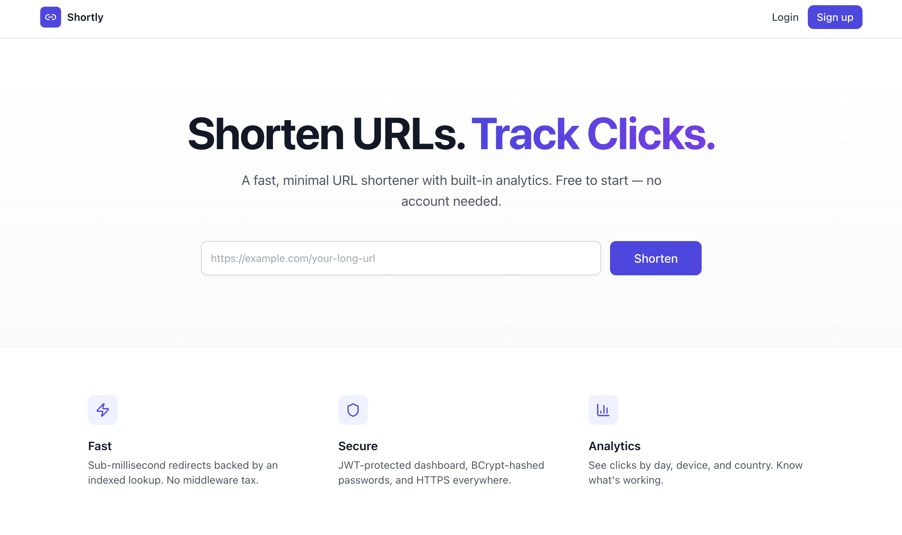
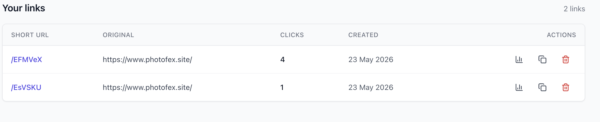
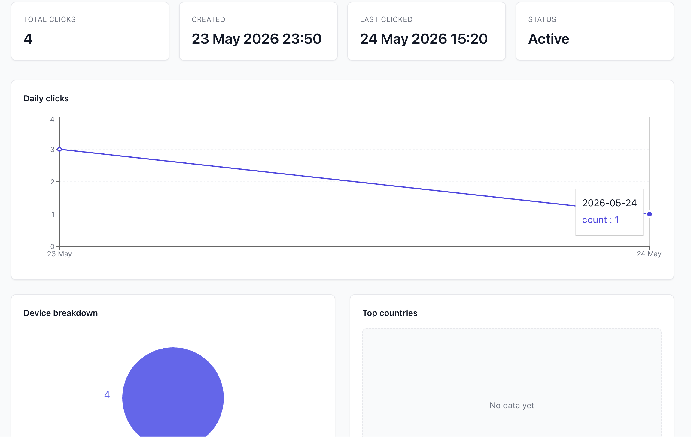
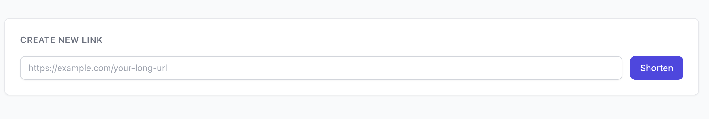
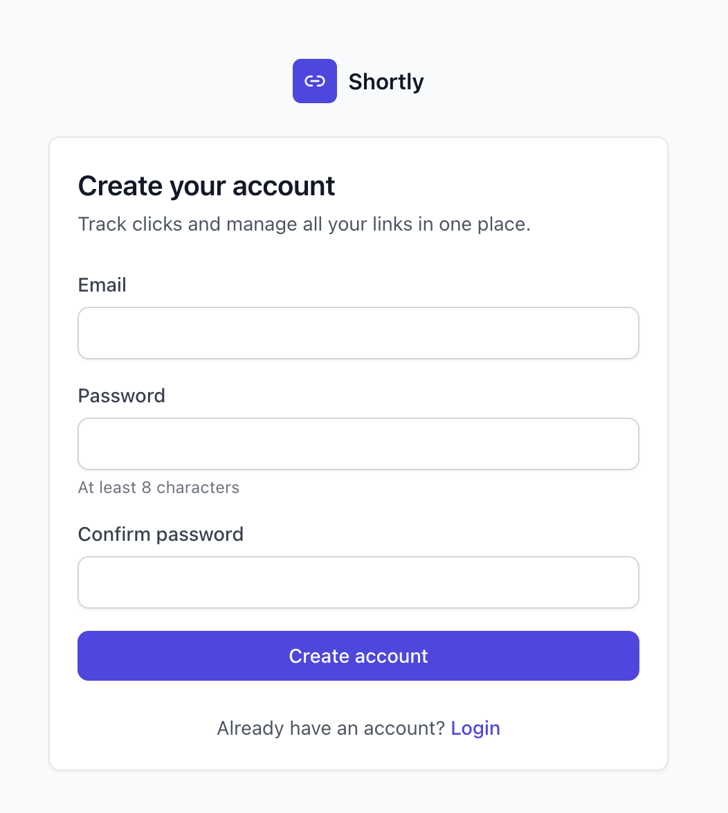
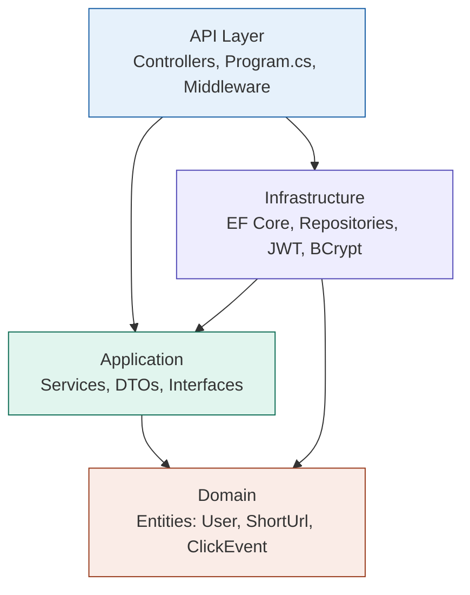

# URL Shortener with Analytics

> Production-grade URL shortening service with click tracking, analytics dashboard, and JWT authentication. Built with ASP.NET Core 10, React, PostgreSQL, and Clean Architecture.


A full-stack URL shortener demonstrating modern .NET API development practices: Clean Architecture, JWT authentication, EF Core migrations, Repository pattern, asynchronous background processing, and a React frontend with analytics charts.

---

## Demo Screenshots

### Landing Page — Anonymous URL Shortening


### After Shortening — Copy & Share


### Dashboard — Manage Your Links


### Analytics — Click Stats by Day, Device, Country


### Mobile Responsive


---

## Features

### Backend
- **URL shortening** with cryptographically secure 6-character codes (~56 billion combinations)
- **Click tracking** with async background processing (non-blocking redirects)
- **Analytics** — clicks by day, device type, country
- **JWT authentication** with BCrypt password hashing (work factor 12)
- **Anonymous + authenticated** dual mode — works without login, optional account for analytics
- **User isolation** — each user only sees their own URLs
- **Soft delete** — disabled links return 404 but preserve historical click data
- **Link expiration** — optional `expiresAt` field
- **Device detection** — Mobile / Desktop / Tablet / Bot from User-Agent
- **REST API** with Swagger UI and JWT support
- **Structured logging** with ILogger
- **CORS configured** for frontend integration

### Frontend
- **Landing page** with instant URL shortening (no signup required)
- **Auth flow** — register, login, JWT-based session
- **Dashboard** with link management (create, list, delete, copy)
- **Stats page** with Recharts visualizations (line, pie, bar)
- **Toast notifications** for feedback
- **Mobile responsive** design
- **Protected routes** with auto-redirect on 401

---

## Tech Stack

### Backend
| Layer            | Technology                                         |
|------------------|----------------------------------------------------|
| Runtime          | .NET 10 LTS                                        |
| Framework        | ASP.NET Core Web API                               |
| Database         | PostgreSQL 16                                      |
| ORM              | Entity Framework Core 10 with Npgsql provider     |
| Authentication   | JWT Bearer + BCrypt.Net-Next                       |
| Documentation    | Swashbuckle.AspNetCore 10 (Swagger UI)             |
| Logging          | Microsoft.Extensions.Logging                       |
| Testing          | xUnit, Moq, FluentAssertions, Testcontainers       |

### Frontend
| Layer            | Technology                          |
|------------------|-------------------------------------|
| Build tool       | Vite                                |
| Framework        | React 19 with TypeScript            |
| Styling          | Tailwind CSS                        |
| Routing          | React Router                        |
| HTTP             | Axios (with JWT interceptor)        |
| State            | Zustand                             |
| Charts           | Recharts                            |
| Notifications    | react-hot-toast                     |
| Icons            | lucide-react                        |

---

## Architecture

The backend follows **Clean Architecture** principles with strict dependency rules:



**Dependency rule:** dependencies only point inward toward Domain. Domain depends on nothing.

---

## Project Structure
url-shortener/
├── src/
│   ├── UrlShortener.Domain/          # Entities, enums (no external dependencies)
│   ├── UrlShortener.Application/      # Business logic, interfaces, DTOs
│   ├── UrlShortener.Infrastructure/   # EF Core, JWT, BCrypt, repositories
│   └── UrlShortener.Api/              # Controllers, Program.cs, Swagger
├── tests/
│   ├── UrlShortener.UnitTests/
│   └── UrlShortener.IntegrationTests/
├── frontend/                          # React + Vite + TypeScript SPA
├── docs/
│   └── screenshots/
└── README.md

---

## Getting Started

### Prerequisites

- [.NET 10 SDK](https://dotnet.microsoft.com/download/dotnet/10.0)
- [PostgreSQL 16+](https://www.postgresql.org/download/)
- [Node.js 20+](https://nodejs.org/) (for frontend)
- [Git](https://git-scm.com/)

### Backend Setup

1. **Clone the repository**

```bash
   git clone https://github.com/burakekinci7/url-shortener.git
   cd url-shortener
```

2. **Create the database**

   In `psql` or pgAdmin, create a database named `urlshortener_dev`:

```sql
   CREATE DATABASE urlshortener_dev;
```

3. **Configure local secrets**

   Create `src/UrlShortener.Api/appsettings.Development.json` (gitignored) with your real values:

```json
   {
     "ConnectionStrings": {
       "DefaultConnection": "Host=localhost;Port=5432;Database=urlshortener_dev;Username=postgres;Password=YOUR_PASSWORD"
     },
     "JwtSettings": {
       "SecretKey": "YOUR_64_CHAR_RANDOM_SECRET_KEY"
     }
   }
```

4. **Apply database migrations**

```bash
   dotnet ef database update \
     --project src/UrlShortener.Infrastructure \
     --startup-project src/UrlShortener.Api
```

5. **Run the API**

```bash
   dotnet run --project src/UrlShortener.Api
```

   API: `http://localhost:5287`
   Swagger UI: `http://localhost:5287/swagger`

### Frontend Setup

1. **Install dependencies**

```bash
   cd frontend
   npm install
```

2. **Run the dev server**

```bash
   npm run dev
```

   Frontend: `http://localhost:5173`

Open both terminals — backend on 5287, frontend on 5173. CORS is configured to allow this combination.

---

## API Endpoint Reference

| Method | Endpoint                       | Auth     | Description                          |
|--------|--------------------------------|----------|--------------------------------------|
| POST   | `/api/auth/register`           | —        | Register a new user                  |
| POST   | `/api/auth/login`              | —        | Login, returns JWT token             |
| POST   | `/api/urls`                    | Optional | Create a short URL (anon or user)    |
| GET    | `/api/urls`                    | ✓        | List user's URLs                     |
| GET    | `/api/urls/{id}`               | ✓        | Get URL details                      |
| GET    | `/api/urls/{id}/stats`         | ✓        | Get analytics for a URL              |
| DELETE | `/api/urls/{id}`               | ✓        | Soft-delete a URL                    |
| GET    | `/{shortCode}`                 | —        | Redirect to original URL + track     |

---

## Key Design Decisions

### Anonymous + Authenticated dual mode
The `POST /api/urls` endpoint accepts requests with or without a JWT. When a token is present, the URL is associated with the user; when absent, `UserId` is null and the link is anonymous. This reduces signup friction — visitors can try the service immediately and sign up later for analytics. Implemented with `[AllowAnonymous]` on the create endpoint while keeping the controller-level `[Authorize]` for all other actions.

### Clean Architecture with strict dependency rules
Domain has zero external dependencies. Application defines interfaces (`IUserRepository`, `IJwtTokenGenerator`) that Infrastructure implements. This enables testing services without touching the database and swapping implementations (e.g., PostgreSQL to MongoDB) without changing business logic.

### Cryptographically secure short codes
`ShortCodeGenerator` uses `RandomNumberGenerator.GetBytes()` instead of `new Random()`. Predictable codes would allow attackers to enumerate links and hijack traffic. With 62 alphabet × 6 length = ~56 billion combinations, collisions are statistically negligible, but a unique constraint on `ShortCode` is still enforced.

### Fire-and-forget click tracking with IServiceScopeFactory
Click tracking happens **after** the HTTP redirect returns, in a background `Task.Run`. The first naïve implementation injected `IClickTrackingService` directly, which caused `ObjectDisposedException` because the request's DI scope was torn down before the task ran. The fix: inject `IServiceScopeFactory` (singleton), create a fresh scope inside the background task, and resolve the service from that scope. This pattern is essential for any background work that needs scoped services.

### Soft delete for URLs
Deleting a URL sets `IsActive = false` rather than removing the row. Historical click events stay intact for analytics, and existing inbound links return 404 (not stale redirects). The trade-off: storage grows over time, mitigated by indexing `IsActive` in queries.

### ClickCount denormalization
Each click increments `ShortUrls.ClickCount` directly, rather than computing `COUNT(*)` from `ClickEvents` on every analytics request. This makes the URL list endpoint O(1) per row instead of O(N) per row. The trade-off: a small consistency risk under high concurrency (currently mitigated by single-process deployment; future improvement noted below).

### Authorization at the service layer
Every `GetByIdAsync`, `DeleteAsync`, etc. takes a `userId` parameter and verifies ownership before returning data. This means authorization is enforced even if a controller forgets to check — defense in depth.

---

## Future Improvements

- **Redis caching** for short code lookups (currently every redirect hits the database)
- **Rate limiting** to prevent abuse of URL creation
- **Optimistic concurrency** on `ClickCount` updates (atomic `UPDATE ... SET ClickCount = ClickCount + 1`)
- **GeoIP integration** (MaxMind GeoLite2) to populate `Country` from IP
- **Refresh tokens** with shorter access token lifetime
- **Custom short codes** (user-selected slugs like `short.ly/my-link`)
- **Bulk operations** (CSV import of URLs)
- **Docker** + docker-compose for one-command setup
- **CI/CD** with GitHub Actions (build, test, deploy)
- **Background job queue** (replace `Task.Run` with proper queue using Channels or Hangfire)
- **Production deployment** (Railway / Render / Azure)

---

## What I Learned Building This

- **Clean Architecture in practice** — understanding why each layer exists, not just memorizing the structure.
- **DbContext lifetime management** — scoped services in background tasks require fresh scopes. Debugging `ObjectDisposedException` taught me this.
- **Package version compatibility** — .NET 10 + Swashbuckle 10 had breaking changes from older versions (`Microsoft.OpenApi.Models` namespace moved). Resolved by reading the official migration guide.
- **JWT internals** — claims, signing keys, validation parameters, the importance of `ClockSkew = TimeSpan.Zero`.
- **Async patterns** — when to use `CancellationToken.None` for fire-and-forget vs propagating the request's token.
- **CORS configuration** — middleware ordering matters (CORS must come before Authentication).
- **Anonymous + authenticated flow** — designing API endpoints that work in both modes cleanly.

---

## License

MIT — see [LICENSE](LICENSE) for details.